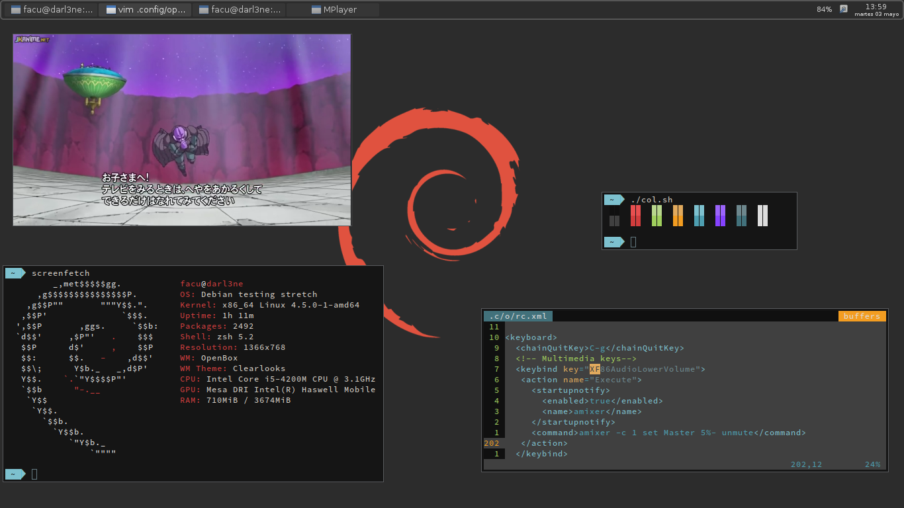

# Personal Dotfiles

### Requirements
- Debian GNU/Linux testing (stretch)
- Lightdm 1.18.1-1
- Openbox 3.6.1O
- oh-my-zsh: `sh -c "$(curl -fsSL https://raw.githubusercontent.com/robbyrussell/oh-my-zsh/master/tools/install.sh)"`
- powerlevel9k: `git clone https://github.com/bhilburn/powerlevel9k.git ~/.oh-my-zsh/custom/themes/powerlevel9k`
- source-code-pro: `wget https://github.com/adobe-fonts/source-code-pro/archive/2.010R-ro/1.030R-it.zip`

